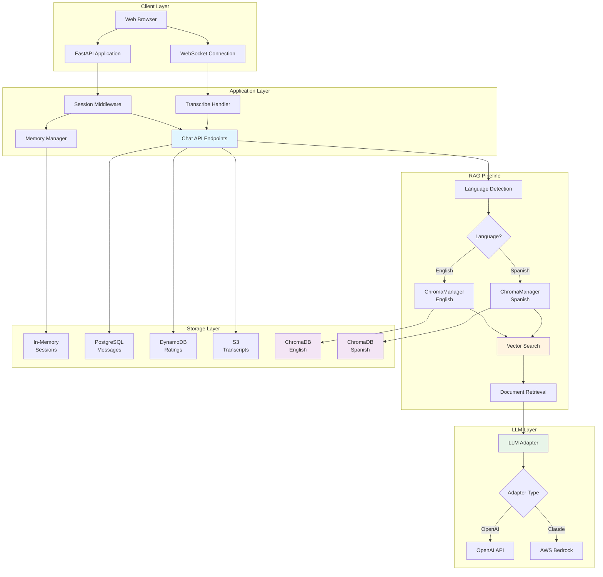
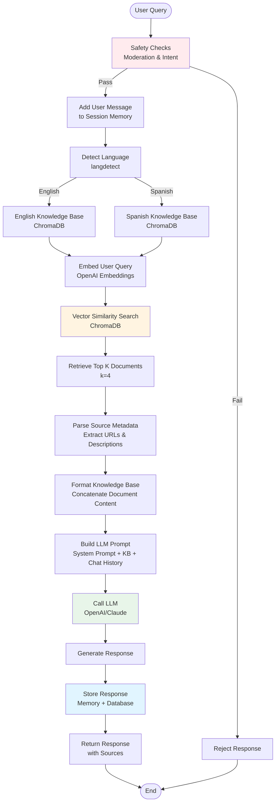
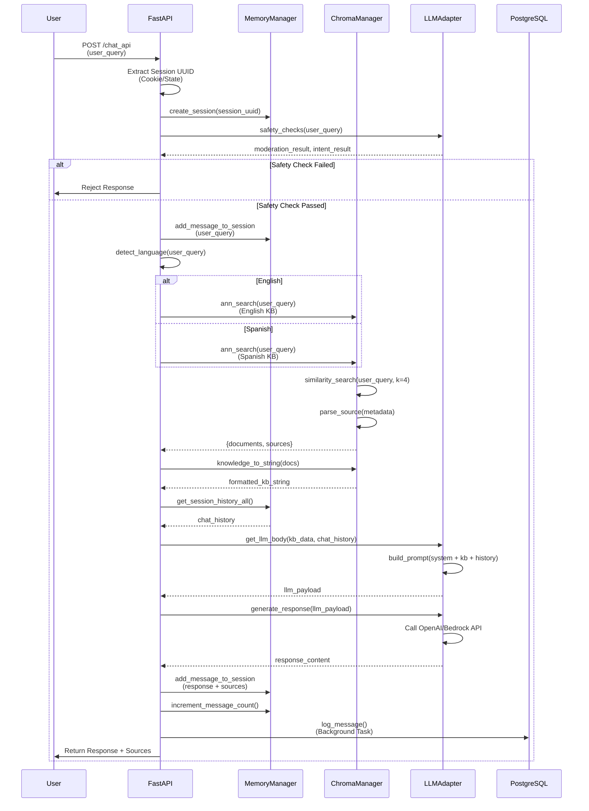
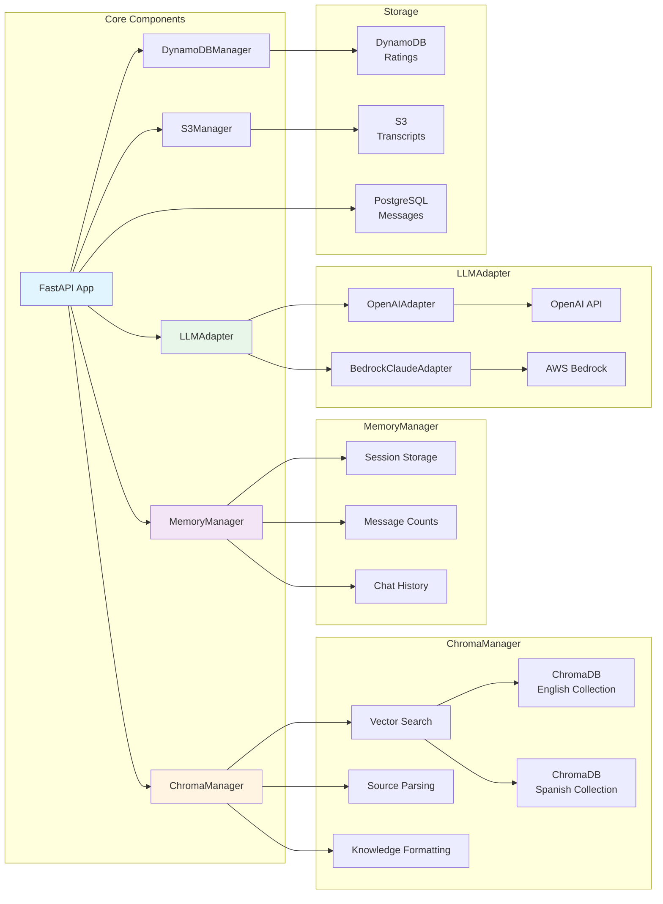
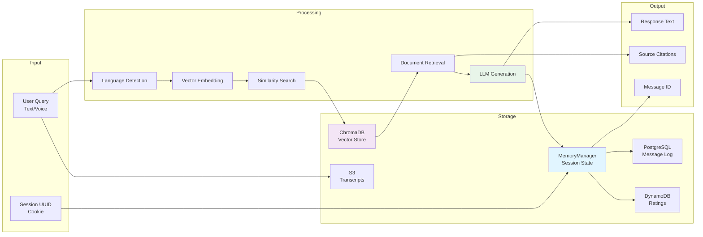

# WaterBot - RAG-Powered Chatbot for Arizona Water Information

WaterBot is a Retrieval-Augmented Generation (RAG) chatbot that provides information about water in Arizona. It uses FastAPI, ChromaDB for vector storage, and supports both OpenAI and Claude (AWS Bedrock) LLM adapters.

## Table of Contents

- [Overview](#overview)
- [Architecture](#architecture)
- [RAG Pipeline Flow](#rag-pipeline-flow)
- [Request/Response Flow](#requestresponse-flow)
- [Component Interactions](#component-interactions)
- [Data Flow](#data-flow)
- [Getting Started](#getting-started)
- [API Endpoints](#api-endpoints)
- [Configuration](#configuration)

## Overview

WaterBot is a conversational AI application that:
- Answers questions about water in Arizona using RAG (Retrieval-Augmented Generation)
- Supports both English and Spanish languages
- Maintains conversation history per session
- Provides source citations for answers
- Supports voice transcription via Amazon Transcribe
- Stores conversations in PostgreSQL and DynamoDB

## Architecture

### System Architecture Diagram



## RAG Pipeline Flow

### RAG Pipeline Detailed Flow



## Request/Response Flow

### Chat API Request Flow



## Component Interactions

### Component Interaction Diagram



## Data Flow

### Data Flow Through the System



## Getting Started

### Prerequisites

```bash
# Install system dependencies
sudo apt-get install jq

# Python 3.11+
python3.11 -m venv .venv
source .venv/bin/activate
```

### Environment Variables

Create a `.env` file in the `application/` directory:

```bash
# OpenAI Configuration
OPENAI_API_KEY=your_openai_api_key

# AWS Configuration
AWS_ACCESS_KEY_ID=your_aws_key
AWS_SECRET_ACCESS_KEY=your_aws_secret
AWS_SESSION_TOKEN=your_session_token  # Optional

# Database Configuration
DB_HOST=your_db_host
DB_USER=your_db_user
DB_PASSWORD=your_db_password
DB_NAME=your_db_name

# AWS Services
MESSAGES_TABLE=your_dynamodb_table
TRANSCRIPT_BUCKET_NAME=your_s3_bucket
```

### Installation

```bash
cd application
pip install -r requirements.txt
```

### Running Locally

```bash
# Activate virtual environment
source .venv/bin/activate

# Run FastAPI application
fastapi dev main.py
# or
uvicorn main:app --reload
```

### Running in Docker

```bash
./docker_build.sh
./docker_run.sh
```

## API Endpoints

### Chat Endpoints

| Endpoint | Method | Description |
|----------|--------|-------------|
| `/chat_api` | POST | Main chat endpoint for WaterBot |
| `/riverbot_chat_api` | POST | Chat endpoint for RiverBot persona |
| `/chat_sources_api` | POST | Get sources for previous response |
| `/chat_actionItems_api` | POST | Get action items from previous response |
| `/chat_detailed_api` | POST | Get detailed response for previous query |

### Other Endpoints

| Endpoint | Method | Description |
|----------|--------|-------------|
| `/waterbot` | GET | WaterBot HTML interface |
| `/riverbot` | GET | RiverBot HTML interface |
| `/transcribe` | WebSocket | Voice transcription endpoint |
| `/session-transcript` | POST | Download session transcript |
| `/submit_rating_api` | POST | Submit rating for a message |

## Configuration

### LLM Adapter Selection

In `main.py`, configure the adapter:

```python
# Available adapters
ADAPTERS = {
    "claude.haiku": BedrockClaudeAdapter("anthropic.claude-3-haiku-20240307-v1:0"),
    "claude.": BedrockClaudeAdapter("anthropic.claude-3-sonnet-20240229-v1:0"),
    "openai-gpt4.1": OpenAIAdapter("gpt-4.1")
}

# Set adapter
llm_adapter = ADAPTERS["openai-gpt4.1"]  # or "claude.haiku"
```

### ChromaDB Configuration

The ChromaDB collection name defaults to `"langchain"`. To use a different collection:

```python
knowledge_base = ChromaManager(
    persist_directory="docs/chroma/",
    embedding_function=embeddings,
    collection_name="your_collection_name"
)
```

### RAG Parameters

- **Top K Documents**: Default is 4 (configurable in `ann_search` method)
- **Chunk Size**: 1500 characters with 150 overlap (when adding documents)
- **Embedding Model**: OpenAI `text-embedding-ada-002` (via OpenAIEmbeddings)

## RAG Pipeline Components

### 1. ChromaManager
- **Purpose**: Manages vector database operations
- **Key Methods**:
  - `ann_search()`: Performs vector similarity search
  - `knowledge_to_string()`: Formats retrieved documents for LLM
  - `parse_source()`: Extracts and formats source metadata

### 2. MemoryManager
- **Purpose**: Manages conversation sessions and history
- **Key Methods**:
  - `create_session()`: Creates new conversation session
  - `add_message_to_session()`: Stores messages with sources
  - `get_session_history_all()`: Retrieves full conversation history

### 3. LLM Adapters
- **OpenAIAdapter**: Uses OpenAI GPT models
- **BedrockClaudeAdapter**: Uses AWS Bedrock Claude models
- Both implement:
  - `get_llm_body()`: Builds prompt with knowledge base
  - `generate_response()`: Calls LLM API
  - `safety_checks()`: Validates user input

## Troubleshooting

### RAG Pipeline Not Working

1. **Check ChromaDB Collection**: Ensure the collection name matches what was used when documents were added
   ```python
   # Verify collection exists
   knowledge_base = ChromaManager(
       persist_directory="docs/chroma/",
       embedding_function=embeddings,
       collection_name="langchain"  # Must match collection used when adding docs
   )
   ```

2. **Check Embeddings**: Verify embeddings are being generated
   ```python
   # Test embeddings
   embeddings = llm_adapter.get_embeddings()
   test_embedding = embeddings.embed_query("test")
   ```

3. **Check Documents**: Verify documents exist in ChromaDB
   ```python
   # Check if collection has documents
   docs = await knowledge_base.ann_search("test query")
   print(f"Retrieved {len(docs['documents'])} documents")
   ```

### Common Issues

- **"Collection langchain is not created"**: Ensure `collection_name="langchain"` is set in ChromaManager
- **Empty search results**: Verify documents were added to ChromaDB with the correct collection name
- **Embedding rate limits**: Check OpenAI API rate limits if using OpenAI embeddings

## Project Structure

```
waterbot/
├── application/
│   ├── main.py                 # FastAPI application
│   ├── managers/
│   │   ├── chroma_manager.py   # Vector database manager
│   │   ├── memory_manager.py   # Session management
│   │   ├── dynamodb_manager.py # DynamoDB operations
│   │   └── s3_manager.py       # S3 operations
│   ├── adapters/
│   │   ├── openai.py           # OpenAI adapter
│   │   ├── claude.py           # Claude/Bedrock adapter
│   │   └── base.py             # Base adapter interface
│   ├── docs/
│   │   └── chroma/             # ChromaDB storage
│   └── templates/              # HTML templates
├── docker_build.sh
├── docker_run.sh
└── README.md
```

## License

See LICENSE file for details.

## Additional Information

For deployment instructions, see the original README sections on:
- Running locally (container/no container)
- Deploying to AWS
- CDK prerequisites
- Environment-specific deployments
